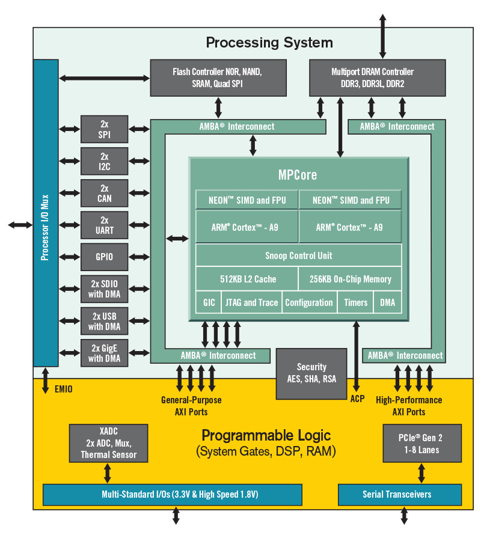

# [XC7Z020](https://github.com/sochub/XC7Z020)
 
#### 厂商：[anlogic](http://www.anlogic.com)
#### 归属：[FPGA](https://github.com/sochub/FPGA)
#### 芯片定级：[Level](https://github.com/sochub/Level)
## [描述](https://github.com/sochub/XC7Z020/wiki) 

[XC7Z020](https://github.com/sochub/XC7Z020) 配备双核 ARM Cortex-A9 处理器最高主频可达 866MHz，与基于 28nm Artix-7 可编程逻辑集成，可编程逻辑单元数量区间为 23K-85K，内部集成的 Block RAM 可达 4.9MByte；从 6.6Gb/s 到 12.5Gb/s 的收发器。

 

### [收录资源](https://github.com/sochub/XC7Z020)

* [文档](docs/)
* [资源](src/)

### [关联资源](https://github.com/sochub)

* [编译工具](https://github.com/sochub/RISCV-GNU)

### [选型建议](https://github.com/sochub)

[XC7Z020](https://github.com/sochub/XC7Z020)为高性能FPGA SoC产品

 典型运用领域

* 电机控制
* 医疗设备
* 雷达声纳
* 电力采集
* 机器视觉

##  [SoC资源平台](http://www.qitas.cn)  
